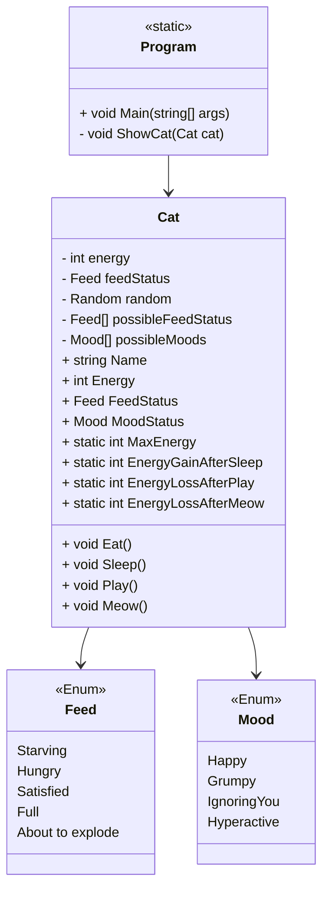

```mermaid
classDiagram
direction TB
    class Program {
        <<static>>
        + void Main(string[] args)
        - void ShowCat(Cat cat)
    }

    class Cat {
        - int energy
        - Feed feedStatus
        - Random random
        - Feed[] possibleFeedStatus
        - Mood[] possibleMoods
        + string Name
        + int Energy
        + Feed FeedStatus
        + Mood MoodStatus
        + void Eat()
        + void Sleep()
        + void Play()
        + void Meow()
        + static int MaxEnergy
        + static int EnergyGainAfterSleep
        + static int EnergyLossAfterPlay
        + static int EnergyLossAfterMeow
    }

    class Feed {
	    Starving
	    Hungry
	    Satisfied
	    Full
	    About to explode
    }

    class Mood {
	    Happy
	    Grumpy
	    IgnoringYou
	    Hyperactive
    }

	<<Enum>> Feed
	<<Enum>> Mood
    Program --> Cat
    Cat --> Feed
    Cat --> Mood
```